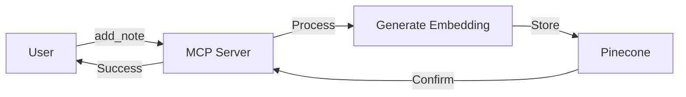

# Product Context

## Purpose & Problems Solved
This project addresses several key challenges:
1. **Vector Storage Integration**: Simplifies the process of storing notes as vector embeddings
2. **Semantic Understanding**: Enables future semantic search capabilities through vector representations
3. **MCP Tool Exposure**: Provides a standardized interface for note operations
4. **Infrastructure Abstraction**: Handles the complexity of vector storage and embedding generation

## User Experience Goals
1. **Simplicity**
   - Single command server startup
   - Clear tool interfaces
   - Straightforward note addition

2. **Reliability**
   - Consistent vector generation
   - Reliable storage operations
   - Clear success/failure feedback

3. **Extensibility**
   - Easy integration with other MCP tools
   - Foundation for additional note operations
   - Flexible metadata management

## Core Workflows

### Note Addition

### Future Workflows
1. **Note Retrieval**
   - Semantic search capabilities
   - Similarity matching
   - Metadata-based filtering

2. **Note Management**
   - Categorization
   - Tagging
   - Batch operations

3. **Integration Features**
   - Multi-tool workflows
   - Chain of thought operations
   - Context-aware processing

## Success Metrics
1. **Reliability**
   - Successful note storage rate
   - Embedding generation accuracy
   - System uptime

2. **Performance**
   - Note processing latency
   - Storage operation speed
   - Tool response time

3. **Usability**
   - Integration ease
   - Tool usage clarity
   - Error feedback quality

## Integration Context
- **MCP Environment**: Designed for Claude and similar AI environments
- **Tool Usage**: Simple, single-purpose tools
- **Data Flow**: Clear input/output patterns
- **Error Handling**: Informative error messages
