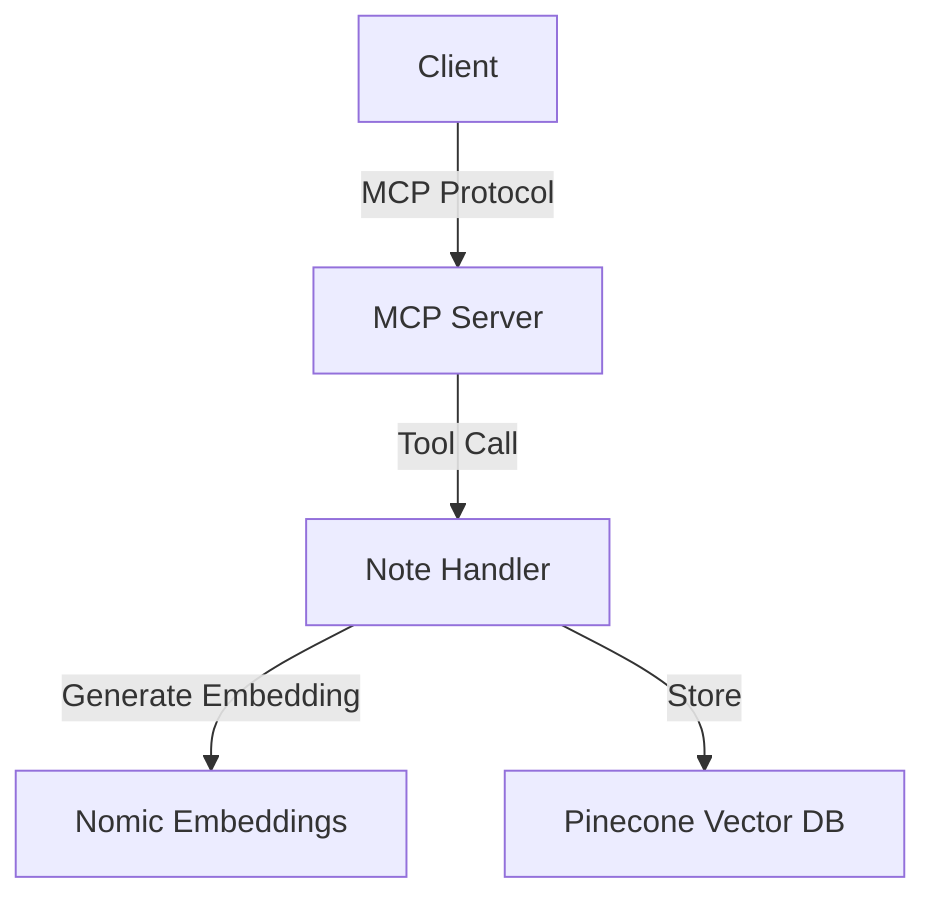
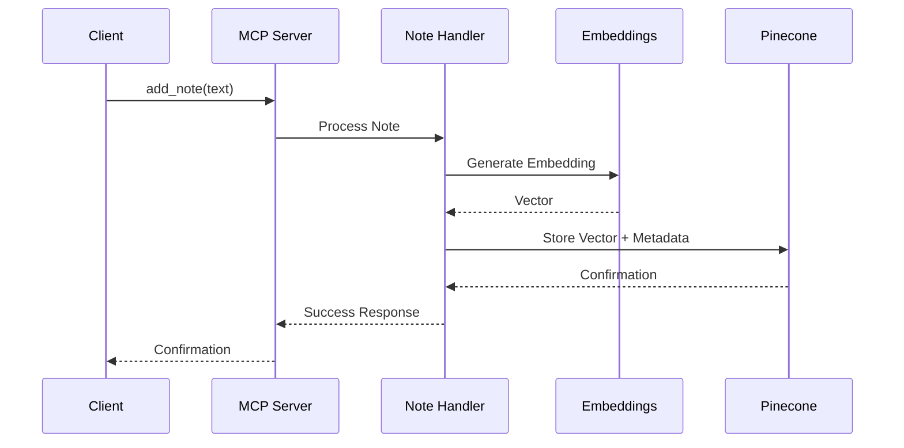

# System Patterns

## Architecture Overview

## Core Components

### 1. MCP Server Layer
- Uses FastMCP implementation
- Exposes tools via stdio transport
- Single tool exposed: `add_note`
- Handles tool registration and execution

### 2. Note Processing
- UUID generation for unique note identification
- Text to vector embedding conversion
- Metadata attachment to vectors

### 3. Vector Storage
- Pinecone serverless infrastructure
- Namespace-based organization
- Vector upsert operations
- Metadata storage alongside vectors

## Design Patterns

### 1. Singleton Pattern
- Global Pinecone client instance
- Single MCP server instance
- Shared namespace configuration

### 2. Factory Pattern
- Pinecone client initialization
- Index creation and management

### 3. Tool Registration Pattern
- Decorator-based tool registration
- Async tool execution
- Type-annotated parameters

## Data Flow

## Error Handling
- Environment validation at startup
- Embedding generation error handling
- Storage operation error handling
- MCP protocol error responses

## Configuration Management
- Environment-based configuration
- Runtime parameter management
- Namespace configuration
- GPU support configuration
